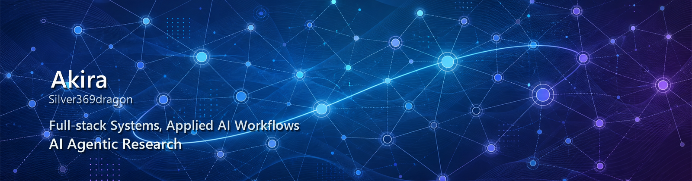

  

  

## Now

I build full-stack tools around web platforms, backend services, automation workflows, and applied AI experiments.

My current direction is shifting toward agent memory, environment feedback, and interfaces that make AI behavior easier to inspect. Long term, I am interested in the overlap between computer science, cognition, adaptive systems, and neuroscience-informed AI.

## Research Direction

I am currently thinking about three questions:

- How does memory representation affect an agent's behavior across a long task?
- What kind of feedback helps an agent recover from mistakes instead of repeating them?
- How can software interfaces make context, attention, and adaptation easier to observe?

## Work

**Operation Zero** 
A web vulnerability learning platform built around progressive labs, containerized challenge environments, and security training flows. The work combines web engineering with hands-on security education.

**EchoScribe** `private project` 
A speech transcription and summarization system using ASR, speaker diarization, and LLM-based text processing. Publicly, I describe this at the system level only because the repository and context are private.

**Automation workflows** `internal work` 
Automation experience around learning-support and multi-step interaction scenarios. The public version of this work is about workflow design, API orchestration, and agent-style task routing without exposing internal process details.

**LLM and agent experiments** 
Learning-focused experiments around local LLMs, LoRA / PEFT concepts, retrieval workflows, dialogue data preparation, and multi-tool agent behavior.

## Tools I Use

| Area | Tools |
| --- | --- |
| Daily development | Python, JavaScript, Flask, FastAPI, React, Vue |
| Web and UI | HTML, CSS, Vite, Tailwind CSS, CSS Modules |
| Systems and data | MySQL, PostgreSQL, Docker, Docker Compose, Linux |
| AI / ML | WhisperX, Pyannote, LLaMA, LoRA, PEFT, RAG, embeddings |
| Workflow automation | n8n, REST APIs, Postman, curl, tool orchestration |

  

